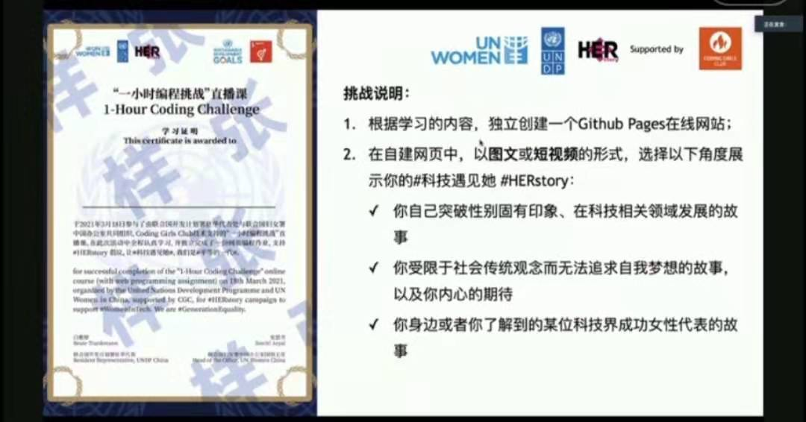
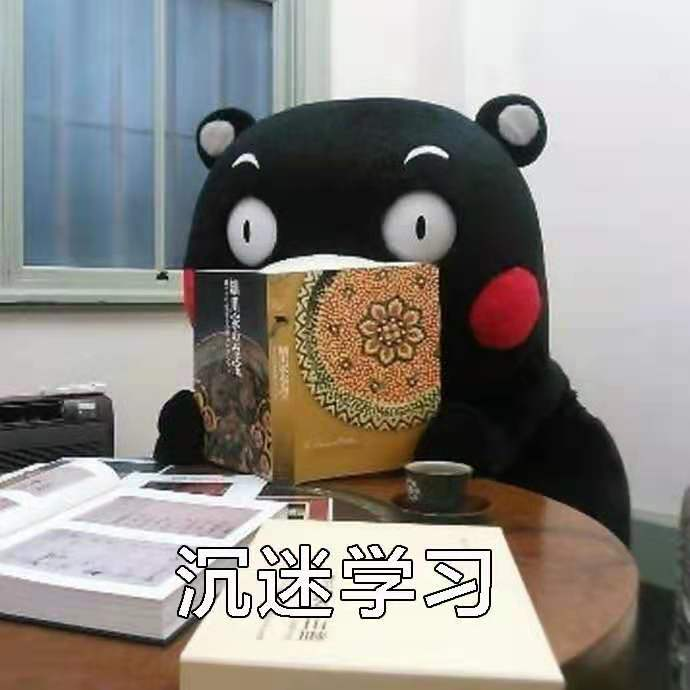
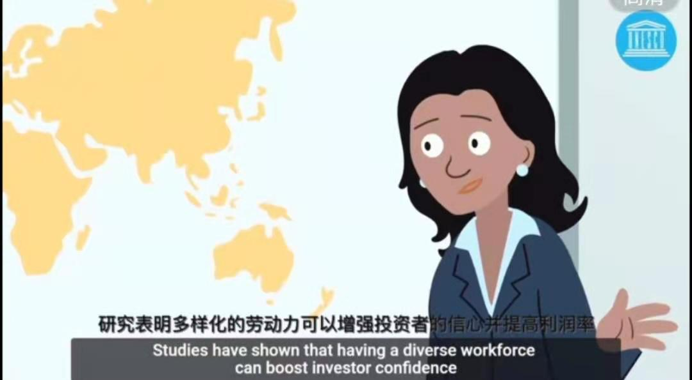
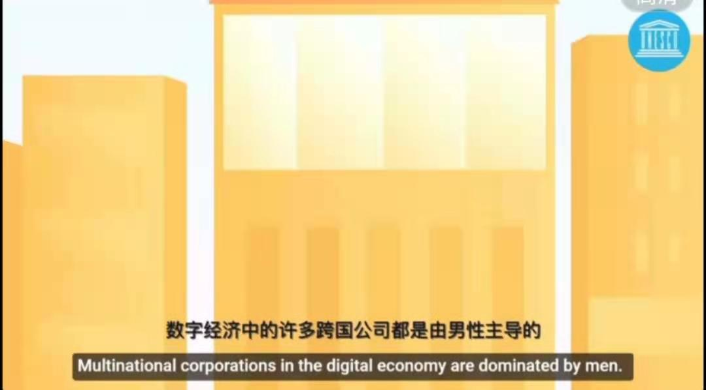
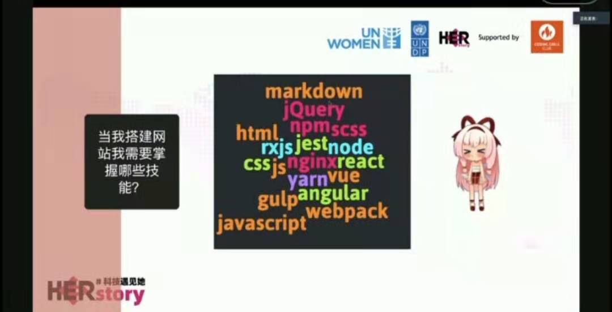
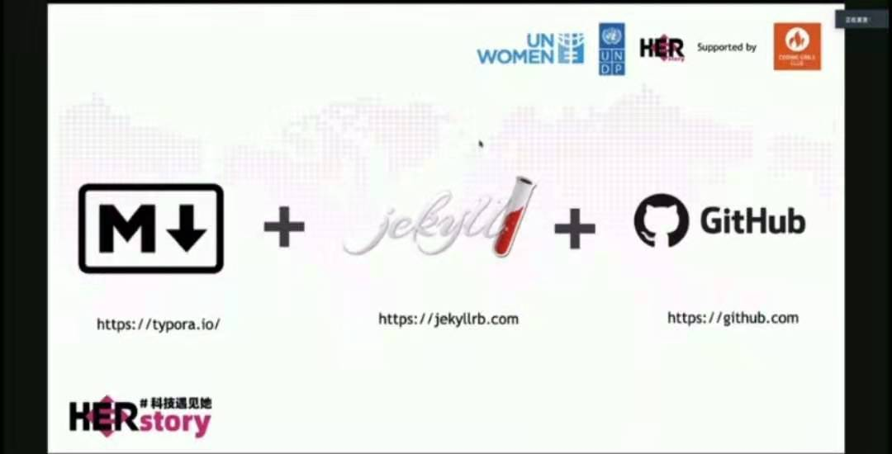
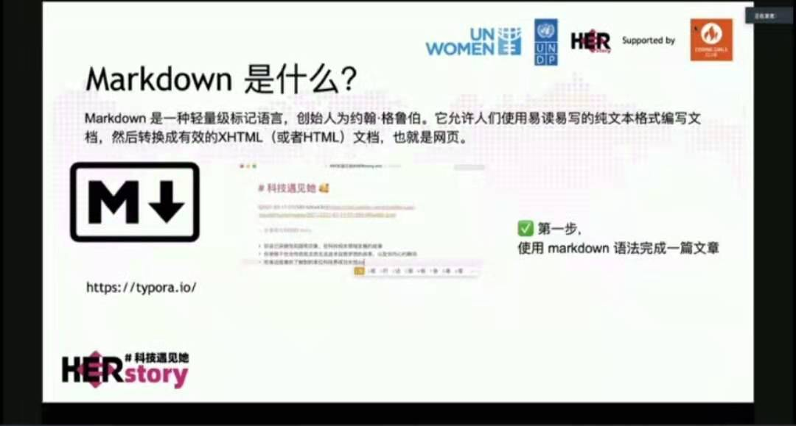
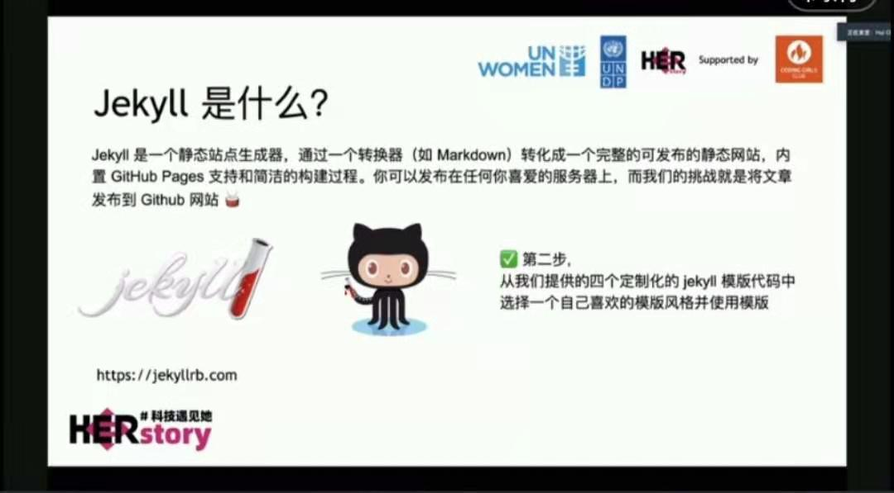
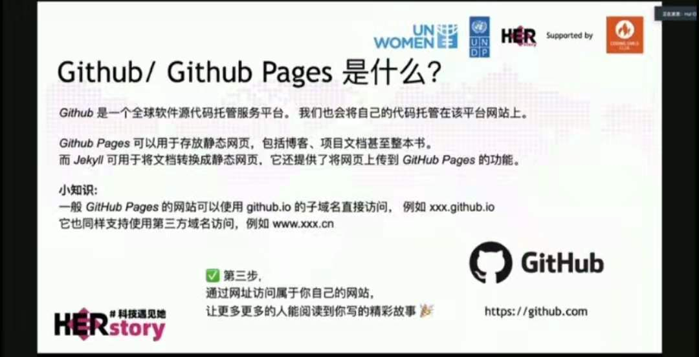
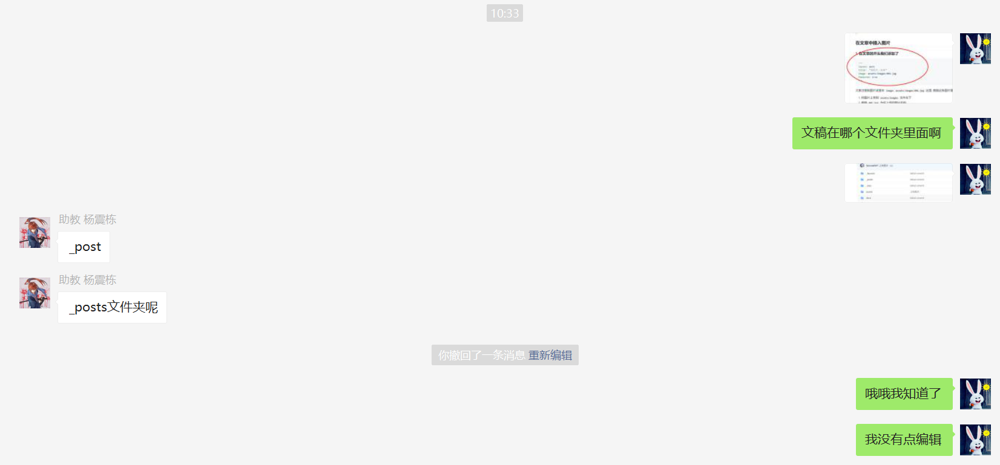

**文: 胡萝卜吃兔兔**  
**图: 胡萝卜吃兔兔**  

3月17日
看见联合国开发署筹备的"让科技遇见她：开聊吧+一小时编程挑战"活动，我就跃跃欲试。  

#### 参加活动的"小心机"
①联合国开发署的证书

②认识不同学科背景的人补充自己的skillsets

#### 课程学习的"小锦囊"
以下三张截图对我的硅谷报告撰写有帮助，硅谷重视diversity，北京相较而言在这方面做得差一点

#### 课程精粹"小回放"

#### 课程互助"小团队"
突然不会做了，会有很多助教在群里及时响应哦~

#### 收获
学习新技能能增加工作的自信，思维更加多元，增加办事的效率。

